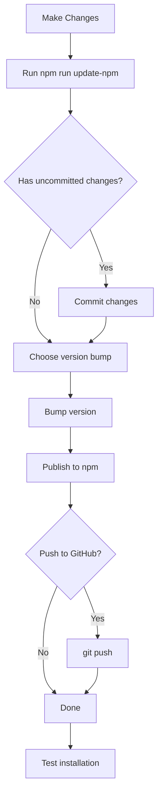

# 🚀 NPM Update & Publish Guide

Automated scripts to update and publish your UPF CLI to npm.

---

## 📦 Quick Start

### Option 1: Interactive Script (Recommended)

```bash
cd "c:\Users\basir\Documents\upf\PHP\exam final\frontend-cli"

# Run the interactive update script
npm run update-npm
```

This will guide you through:
1. ✅ Checking git status
2. ✅ Committing changes
3. ✅ Bumping version (patch/minor/major/custom)
4. ✅ Publishing to npm
5. ✅ Pushing to GitHub

---

### Option 2: Manual Commands

```bash
cd "c:\Users\basir\Documents\upf\PHP\exam final\frontend-cli"

# 1. Check what changed
git status

# 2. Add and commit changes
git add .
git commit -m "fix: correct professor sessions route"

# 3. Bump version
npm version patch    # 0.7.1 → 0.7.2 (bug fixes)
# OR
npm version minor    # 0.7.1 → 0.8.0 (new features)
# OR
npm version major    # 0.7.1 → 1.0.0 (breaking changes)

# 4. Publish to npm
npm publish --access public

# 5. Push to GitHub
git push origin main
```

---

## 🎯 Version Bump Types

| Type | Command | Example | Use When |
|------|---------|---------|----------|
| **Patch** | `npm version patch` | 0.7.1 → 0.7.2 | Bug fixes, small improvements |
| **Minor** | `npm version minor` | 0.7.1 → 0.8.0 | New features, backward compatible |
| **Major** | `npm version major` | 0.7.1 → 1.0.0 | Breaking changes |

---

## 📋 Examples

### Example 1: Bug Fix Update

```bash
# You fixed the professor sessions route
npm run update-npm

# Interactive prompts:
# ❓ Do you have uncommitted changes? y
# 📝 Enter commit message: fix: correct professor sessions route
# 👉 Select option (1-4): 1  (Patch)
# ❓ Ready to publish @basir97/upf-cli@0.7.2 to npm? y
# ❓ Push changes to GitHub? y
```

### Example 2: New Feature Update

```bash
# You added a new AI feature
npm run update-npm

# Interactive prompts:
# ❓ Do you have uncommitted changes? y
# 📝 Enter commit message: feat: add whoami command to AI assistant
# 👉 Select option (1-4): 2  (Minor)
# ❓ Ready to publish @basir97/upf-cli@0.8.0 to npm? y
# ❓ Push changes to GitHub? y
```

### Example 3: Quick Publish (No Git)

```bash
# If you already committed changes
npm version patch
npm publish --access public
```

---

## 🔍 Verify Publication

### Check on npm Website

Visit: https://www.npmjs.com/package/@basir97/upf-cli

### Check via Command Line

```bash
# View package info
npm view @basir97/upf-cli

# View all versions
npm view @basir97/upf-cli versions

# View latest version
npm view @basir97/upf-cli version
```

---

## 🧪 Test Installation

Open a **NEW terminal** to test:

```bash
# Install globally
npm install -g @basir97/upf-cli

# Verify version
upf --version
# Should show: 0.7.2 (or your new version)

# Test functionality
upf ai
>>> bonjour
```

---

## ⚠️ Common Issues

### Issue 1: "You cannot publish over previously published versions"

**Solution:** Bump the version first
```bash
npm version patch
npm publish --access public
```

### Issue 2: "403 Forbidden - Two-factor authentication required"

**Solution:** Create granular access token with bypass 2FA
1. Go to: https://www.npmjs.com/settings/your-username/tokens
2. Create "Granular Access Token"
3. Enable "Bypass 2FA for publishing"
4. Login with token: `npm login --auth-type=legacy`

### Issue 3: "Package name not available"

**Solution:** Use scoped package name
```json
{
  "name": "@basir97/upf-cli"
}
```

### Issue 4: Git push fails

**Solution:** Check branch name
```bash
git branch  # Check current branch
git push origin main  # or 'master' depending on your repo
```

---

## 📊 Complete Workflow



---

## 🎨 Script Features

The `update-npm.js` script provides:

✅ **Interactive prompts** - Guided workflow  
✅ **Git integration** - Auto-commit and push  
✅ **Version management** - Choose bump type  
✅ **Error handling** - Clear error messages  
✅ **Color output** - Easy to read  
✅ **Confirmation steps** - Prevent accidents  

---

## 📁 File Structure

```
frontend-cli/
├── scripts/
│   └── update-npm.js          # Interactive update script
├── package.json                # Contains "update-npm" script
└── NPM_UPDATE_GUIDE.md        # This file
```

---

## 🔗 Useful Links

- **npm Package**: https://www.npmjs.com/package/@basir97/upf-cli
- **GitHub Repo**: https://github.com/younes0basir/exam-final
- **npm Docs**: https://docs.npmjs.com/cli/v10/commands/npm-version
- **Semantic Versioning**: https://semver.org/

---

## 💡 Pro Tips

1. **Always test before publishing**
   ```bash
   npm run dev  # Test locally first
   ```

2. **Use meaningful commit messages**
   ```bash
   feat: add new feature
   fix: resolve bug
   docs: update documentation
   chore: maintenance tasks
   ```

3. **Check npm registry before publishing**
   ```bash
   npm view @basir97/upf-cli
   ```

4. **Keep CHANGELOG.md updated**
   Document what changed in each version.

5. **Test in fresh terminal**
   After publishing, open a NEW terminal to test installation.

---

## 🚀 One-Liner for Quick Updates

If you're confident and want to skip prompts:

```bash
npm version patch && npm publish --access public && git push origin main
```

⚠️ **Warning**: This skips confirmation steps. Use with caution!

---

**Happy Publishing!** 🎉
